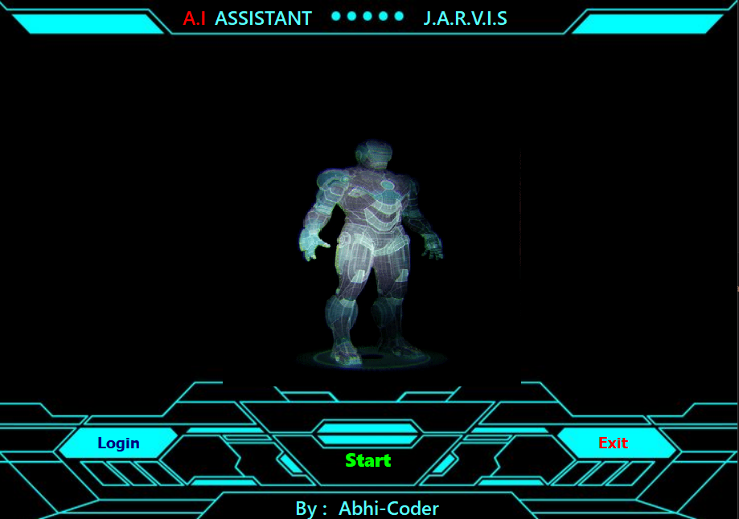
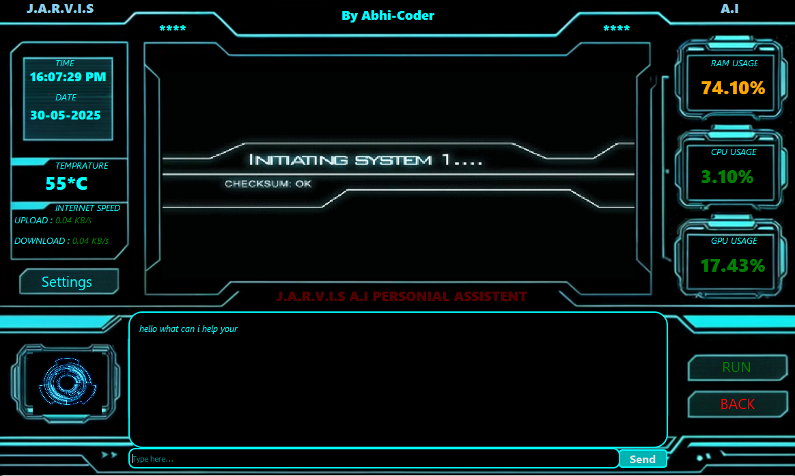

# 🧠 JarviX – AI Voice. Code. Control.

### ⚙️ Python-Powered by [Abhi-Coder](https://github.com/abhithakjutre/abhithakjutre/blob/main/README.md)

---

## 🚀 Overview

**JarviX** is a Python-based AI desktop assistant crafted for coders and tech enthusiasts. It fuses voice control, system automation, a hacker-style GUI, and smart AI logic — making it your ultimate command-line AI companion.

---

## 🎯 Features

- 🎙️ **Voice Recognition** (`speech_recognition`)
- 💬 **Text-to-Speech Responses** (`pyttsx3`)
- 🖥️ **Desktop & Chrome Automation** (`pyautogui`, `webbrowser`)
- 🧠 **AI Brain Logic** for smart replies and actions
- 🧪 **Hacker-Themed PyQt5 GUI**
- 🔐 **(Optional) Login & Profile System**
- 📂 **Organized Modular Structure**

---

## 🛠️ Tech Stack

- **Language:** Python 3.10+
- **Libraries:**  
  `PyQt5`, `speech_recognition`, `pyttsx3`, `pyautogui`,  
  `datetime`, `os`, `webbrowser`, `random`, etc.

---

## 🚦 JarviX Preview

<p align="center">
  <b>Home Main</b><br>
  
</p>

<p align="center">
  <b>Dashboard</b><br>
  
</p>

> **JarviX** welcomes you with a futuristic, hacker-style interface.  
> Speak, code, and control your system with voice and automation!
## 🎥 Video Tutorial
[ 🔗 JarviX Video Tutorial](https://drive.google.com/file/d/1-A9QBBYcNhMZfk0ePt827KIaiMHcOTYX/view?usp=drivesdk)

## 📁 Project Structure
```bash
JarviX/
├── JARVIX_Ear/           # Voice input system
├── JARVIS_Mouth/         # Text-to-Speech responses
├── BRAIN/                # AI logic and brain
├── GUI/                  # PyQt5 GUI with hacker interface
├── AUTOMATION/           # Desktop & browser automation scripts
├── assets/               # Icons, images, audio files
├── main.py               # Main entry point of the project
└── README.md             # Project documentation file

---
```
## 💻 How to Run

```bash
# 1. Clone this repository
git clone https://github.com/your-username/jarvix

# 2. Navigate to the folder
cd jarvix

# 3. Install required modules
pip install -r requirements.txt

# 4. Run the AI Assistant
python main.py
```

👨‍💻 Created by
Abhi-Coder
Python Programmer • Automation Enthusiast • Creator of JarviX

📄 License
```bash
This project is free to use for personal and educational purposes.
Please give credit when sharing or modifying.
```
💬 “Speak it. Code it. Control it — with JarviX.”
